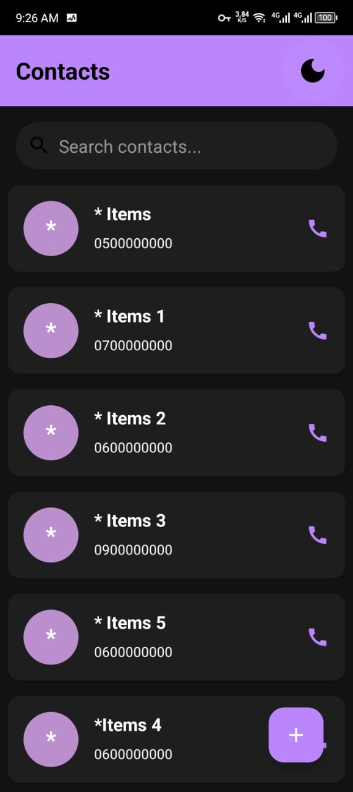
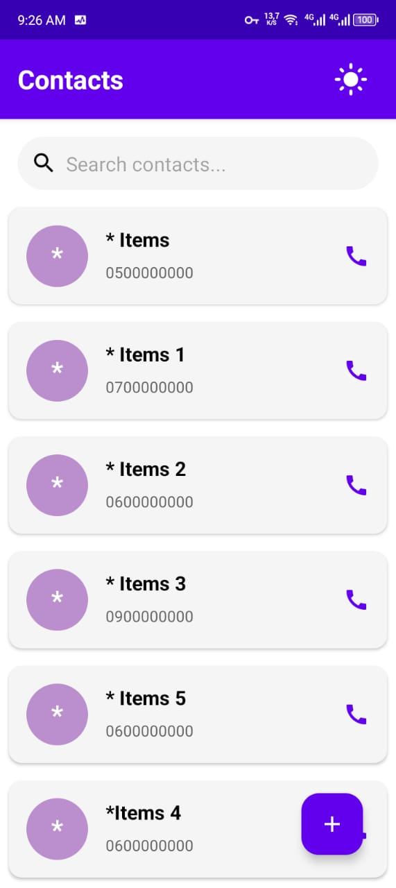
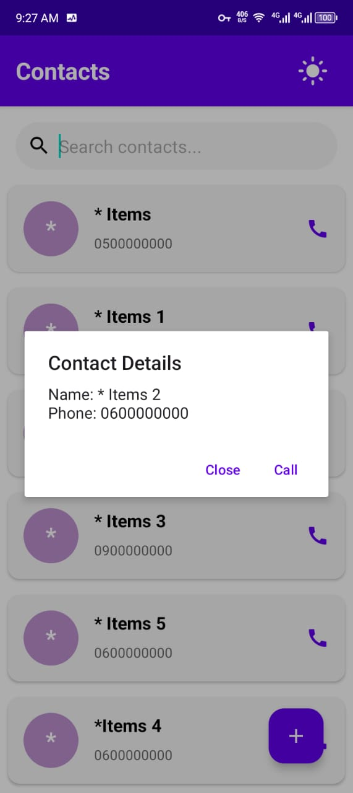
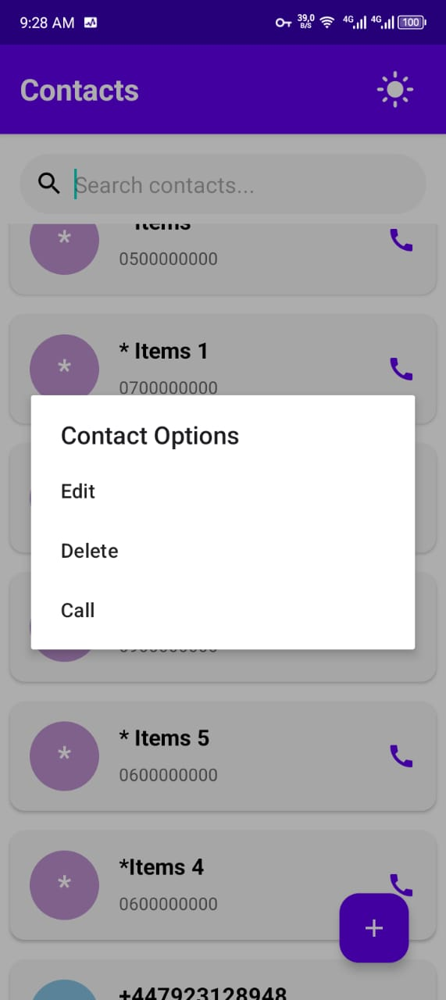
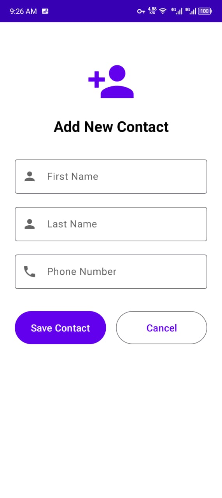
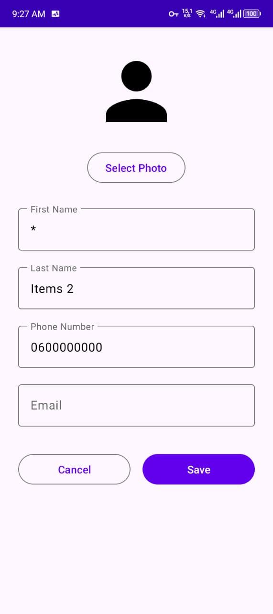

# 📱 Contacts App

A sleek, user-friendly mobile application for managing your contacts effortlessly. Built with a clean interface and intuitive navigation, this app makes it simple to add, view, edit, and manage your important contacts.

---

## 💻 Tech Stack

This application is built for Android using the **Kotlin** programming language.

---

## 🖼️ App Screenshots

Here is a visual overview of the main features and screens of the Contacts App:

| Screen Name | Description | Image |
| :--- | :--- | :--- |
| **Contact List (Dark Mode)** | The main screen showing the list of contacts in the Dark theme. |  |
| **Contact List (Light Mode)** | The main screen showing the list of contacts in the Light theme. |  |
| **Contact Details Modal** | Pop-up displaying a contact's name and phone number with options to Close or Call. |  |
| **Contact Options** | Modal with actions: Edit, Delete, and Call, available on long-press or tap. |  |
| **Add New Contact Screen** | Input form for creating a brand new contact. |  |
| **Edit Contact Screen** | Form for modifying an existing contact, including photo and email fields. |  |

**Note:** *Replace the image paths with the actual URLs if your images are hosted online (e.g., GitHub, Imgur).*


## ✨ Features

### **Contact Management**
* **Add New Contacts:** Quickly add new contacts with fields for **First Name**, **Last Name**, and **Phone Number**.
* **View Contact List:** A clear, scrollable list of all saved contacts, displaying the name and phone number.
* **Search Functionality:** Easily find contacts using the integrated **"Search contacts..."** bar.
* **Contact Details View:** Tap on a contact to view a modal with their **Name** and **Phone** number, along with options to **Close** or **Call**.
* **Contact Options:** Access a menu with **Edit**, **Delete**, and **Call** actions.

### **Editing & Customization**
* **Edit Contact Details:** Modify existing contacts, including changing **First Name**, **Last Name**, **Phone Number**, and optionally adding an **Email** address.
* **Photo Selection:** Option to **Select Photo** for a contact (available in the Edit screen).

### **User Experience (UX)**
* **Calling:** Direct calling functionality from the contact list (via the phone icon) and the details/options screen.
* **Theme Toggle:** A **Light/Dark Mode** switch is available for a personalized viewing experience.

---

## 🚀 How to Use

### **1. Viewing Contacts**
* The main screen displays your entire list of contacts.
* Use the **Search bar** at the top to quickly filter the list.
* Tap the **phone icon** on the right of any contact to initiate a call immediately.
* Tap on a contact entry to view the **Contact Details** pop-up, which also gives you options to **Close** or **Call**.

### **2. Adding a New Contact**
1.  Tap the large **purple plus button** ($\mathbf{+}$) at the bottom right of the main screen.
2.  Fill in the required fields: **First Name**, **Last Name**, and **Phone Number**.
3.  Tap **Save Contact** to save the new entry.

### **3. Editing or Deleting a Contact**
1.  Access the **Contact Options** menu by long-pressing (or tapping) a contact.
2.  Select **Edit** to open the full edit screen. Tap **Save** when done.
3.  Select **Delete** to remove the contact from the list.
4.  Select **Call** to immediately call the contact.

### **4. Switching Themes**
* Tap the **sun/moon icon** in the top right corner of the main screen to toggle between **Light Mode** and **Dark Mode**.

---

## 🛠️ Installation (For Developers)

This section provides instructions for setting up the Android project using Kotlin.

### **Prerequisites**
* **Android Studio:** Latest version recommended.
* **Android SDK:** Set up for API level [Insert Target SDK Level].
* **Kotlin** plugin installed in Android Studio (usually included by default).

### **Setup Steps**

1.  **Clone the repository:**
    ```bash
    git clone [https://github.com/AX-RF/ContactApp.git]
    cd contacts-app
    ```
2.  **Open in Android Studio:**
    * Launch Android Studio.
    * Select **"Open an existing Android Studio project"** and navigate to the cloned `contacts-app` directory.
3.  **Sync Project:**
    * Android Studio should automatically prompt you to sync the project with Gradle. Click **"Sync Now"** if prompted, or use the **"Sync Project with Gradle Files"** button.
4.  **Run the application:**
    * Select your target device (emulator or physical device) from the toolbar.
    * Click the **Run** button (green triangle) to build and deploy the application.

---

## 🤝 Contributing

We welcome contributions! If you have suggestions for new features, bug fixes, or improvements, please feel free to:

1.  Fork the repository.
2.  Create a new branch (`git checkout -b feature/AmazingFeature`).
3.  Commit your changes (`git commit -m 'Add some AmazingFeature'`).
4.  Push to the branch (`git push origin feature/AmazingFeature`).
5.  Open a Pull Request.

---

## 📄 License

*(Add your licensing information here. Common options are MIT, Apache 2.0, etc.)*

Distributed under the **[LICENSE NAME]** License. See `LICENSE` for more information.

---

## 📞 Contact

Project Link: [https://github.com/AX-RF/ContactApp.git]
